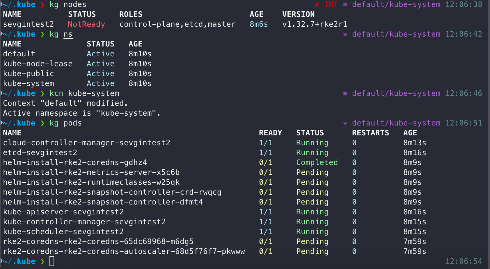
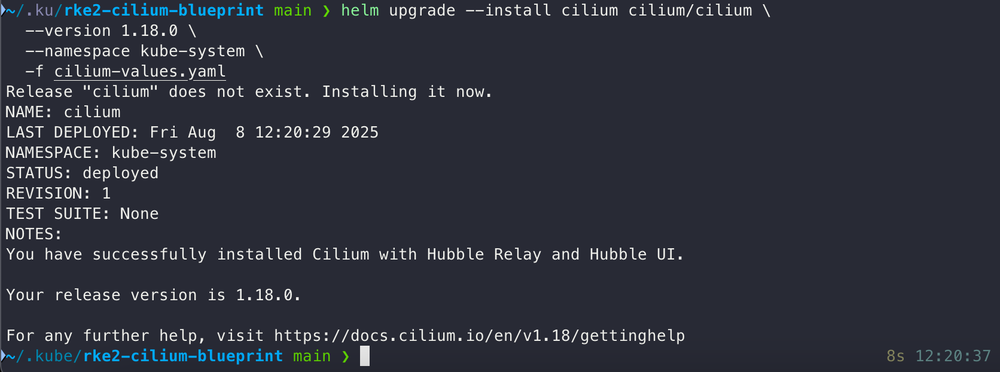
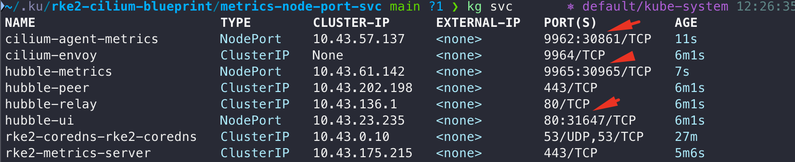
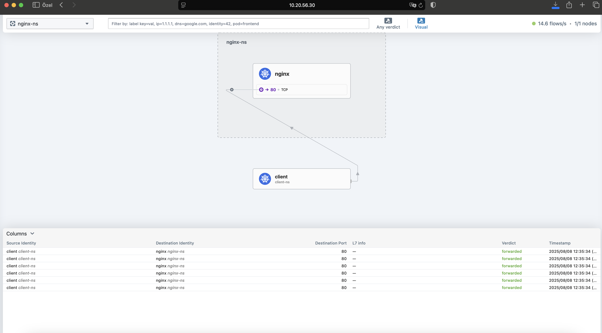
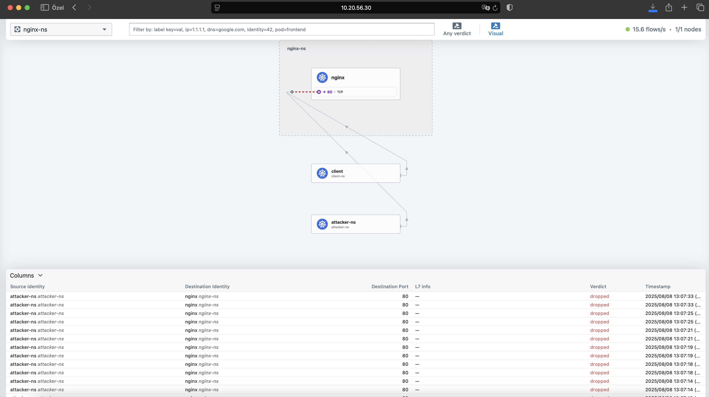
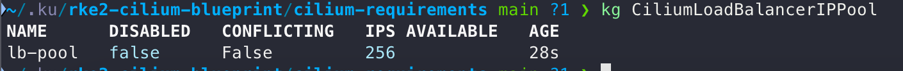
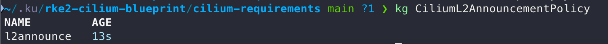
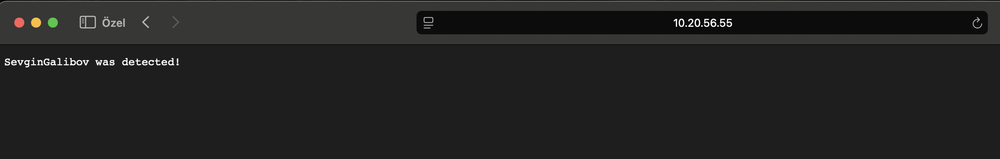

# 🚀 RKE2 + Cilium (Strict Mode) + LB-IPAM & L2 Announcements Kurulumu

Bu doküman, **RKE2 Kubernetes** kümesini kube-proxy’siz (`strict` mode) olarak **Cilium** ile çalıştırıp;

* İstediğimiz **sabit LoadBalancer IP**’lerini atamayı,
* **L2 Announcements** ile bu IP’leri ağda ARP/NDP üzerinden duyurmayı,
* Ve güvenlik politikaları ile trafik kontrolü sağlamayı adım adım gösterir.

💡 **Hedef:** MetalLB gibi ek bileşenlere gerek kalmadan, **Layer-2** segmentindeki cihazlardan doğrudan erişilebilir servisler oluşturmak.

---

## 📌 İçindekiler

1. [RKE2 Kurulumu](#-rke2-kurulumu)
2. [Cilium Kurulumu](#-cilium-kurulumu)
3. [Metrics & Hubble UI Yayını](#-metrics--hubble-ui-yayını)
4. [Network Restriction Örneği](#-network-restriction-örneği)
5. [Cilium LB-IPAM & L2 Announcements](#-cilium-lb-ipam--l2-announcements)
6. [Demo ve Sonuç](#-demo-ve-sonuç)

---

## 🛠 RKE2 Kurulumu

```bash
sudo mkdir -p /etc/rancher/rke2
```
```bash
sudo tee /etc/rancher/rke2/config.yaml > /dev/null << 'EOF'
write-kubeconfig-mode: "0644"
node-ip: "10.20.56.30"
disable:
  - rke2-canal
  - rke2-ingress-nginx
disable-kube-proxy: true
tls-san:
  - "10.20.56.30"
EOF
```
```bash
curl -sfL https://get.rke2.io | INSTALL_RKE2_TYPE=server sh -
```
```bash
systemctl enable rke2-server --now
```
```bash
sudo systemctl start rke2-server.service
```
```bash
export KUBECONFIG=/etc/rancher/rke2/rke2.yaml
```



Pod’ların Pending durumda kalmasının sebebi, kümede henüz bir CNI (Container Network Interface) eklentisinin kurulu olmaması. RKE2, varsayılan CNI’si devre dışı bırakıldığı için (ör. rke2-canal), pod’lar gerekli ağ yapılandırmasına ulaşamıyor ve başlatılamıyor. 
---

## 🐝 Cilium Kurulumu

Prometheus CRD’lerini yükleyelim:

```bash
kubectl apply -f https://raw.githubusercontent.com/prometheus-operator/prometheus-operator/main/example/prometheus-operator-crd/monitoring.coreos.com_servicemonitors.yaml
```

Helm ile Cilium’u yükleyelim:

```bash
helm upgrade --install cilium cilium/cilium \
  --version 1.18.0 \
  --namespace kube-system \
  -f cilium-values.yaml
```



---

## 📊 Metrics & Hubble UI Yayını

Varsayılan servisleri temizleyip, NodePort ile dışa açalım:

```bash
kubectl delete svc cilium-agent -n kube-system
kubectl delete svc hubble-metrics -n kube-system

kubectl apply -f cilium-metrics-nodeport.yaml -n kube-system
kubectl apply -f hubble-metrics-nodeport.yaml -n kube-system
```



* **Metrics URL’leri:**

  * [http://10.20.56.30:30861/metrics](http://10.20.56.30:30861/metrics)
  * [http://10.20.56.30:30965/metrics](http://10.20.56.30:30965/metrics)

(Bu endpoint’ler Prometheus’a hedef olarak eklenip Grafana üzerinden görselleştirilebilir.)

* **Hubble UI:**

  [http://10.20.56.30:31647](http://10.20.56.30:31647)

---

## 🔒 Network Restriction Örneği

Namespace’leri oluşturalım:

```bash
kubectl create ns client-ns
kubectl create ns nginx-ns
```

Pod’ları deploy edelim:

```bash
kubectl apply -f client.yaml -n client-ns
kubectl apply -f nginx.yaml -n nginx-ns
```

Restrict kuralını ekleyelim:

```bash
kubectl apply -f restrict-rule.yaml
```

Client’tan erişim test edelim:

```bash
kubectl -n client-ns exec -it client -- curl nginx.nginx-ns.svc.cluster.local
```
Görselde göründüğü gibi trafik akışında hiçbir sorun yok.


Şimdi Restriction rule unu test etmek için Attacker namespace oluşturalım:

```bash
kubectl create ns attacker-ns
```
```bash
kubectl run -n attacker-ns attacker --rm -it --image=alpine -- sh
apk add curl
curl nginx.nginx-ns.svc.cluster.local
```
Görselde gördündüğü gibi restriction işe yaradı ve istek drop oldu. Nginx pod una sadece client gelebiliyor.


---

## 🌐 Cilium LB-IPAM & L2 Announcements

İstediğimiz sabit IP’leri atamak için havuz oluşturalım:

```bash
kubectl apply -f ip-pool.yaml
```



L2 duyurum politikasını ekleyelim:

```bash
kubectl apply -f cilium-l2ann-policy.yaml
```



---

## 🧪 Demo ve Sonuç

Demo namespace:

```bash
kubectl create ns lb-demo
kubectl apply -f deploy.yaml -n lb-demo
```


Tarayıcı ve curl çıktısı:



---

## 🎯 Özet

Cilium’un **LB-IPAM** özelliği ile servislerimize istediğimiz **sabit LoadBalancer IP**’lerini atayacağız.
**L2 Announcements** sayesinde bu IP’leri ağda ARP/NDP üzerinden duyurarak, aynı Layer-2 segmentindeki cihazların doğrudan erişmesini sağlayacağız.
Böylece MetalLB gibi ek bileşenlere gerek kalmadan, kontrol tamamen elimizde olacak şekilde küme dışı erişim sağlayacağız.
